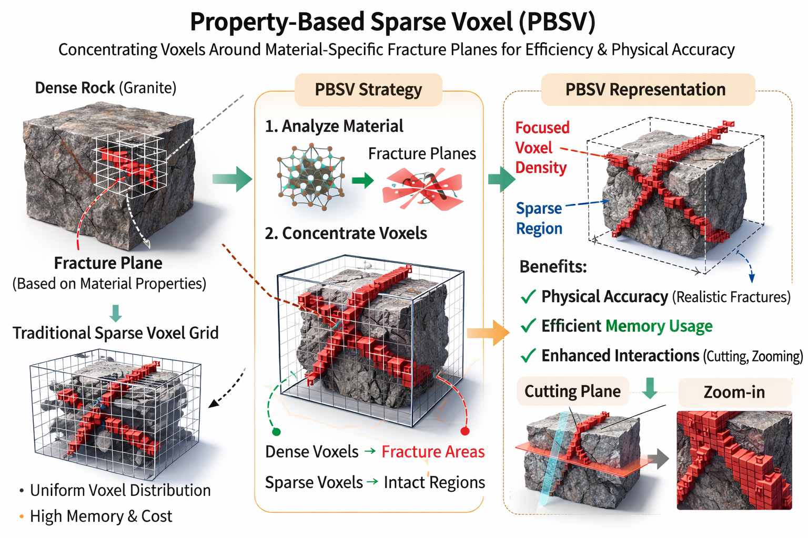

# Property-Based Sparse Voxel (PBSV)

## What is Sparse Voxel?

Sparse Voxel is a technique used to represent 3D objects in a sparse voxel grid.
It is a popular technique in computer graphics for rendering and simulation.

## What is PBSV?

PBSV is a sparsity strategy that uses material property for the guidance.

Let's imagine there is a rock, let's say granite. If we try to break it, it seems
to break randomly but this process is not completely random. There is a set of
fracture planes that is probable to form based on the composition and properties
of the material. We can use advantage of that by concentrating the voxels around
these fracture planes. This will enable maximum physical plausibility upon
interaction while maintaining the performance.
