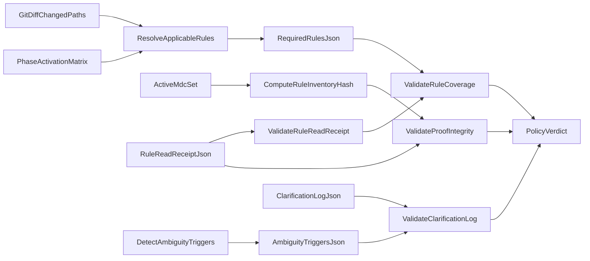

# Hybrid Proof Enforcement

This document defines the tightened hybrid enforcement model:

1. Always-apply rule behavior (`.cursor/rules/*.mdc`),
2. Artifact proof (`rule-read-receipt.json`, `clarification-log.json`),
3. Merge-blocking CI enforcement (`policy-verdict`).

## Why This Exists

Rule guidance alone is not sufficient for robust control because it is difficult to prove at review
time. This model requires machine-verifiable artifacts and independent CI cross-checks so merges are
blocked when evidence is incomplete, inconsistent, or self-asserted without corroboration.

## Required Artifacts

- `artifacts/policy/rule-read-receipt.json`
- `artifacts/policy/required-rules.json`
- `artifacts/policy/changed-paths.json`
- `artifacts/policy/rule-inventory-hash.txt`
- `artifacts/policy/ambiguity-triggers.json`
- `artifacts/policy/clarification-log.json` (required only when triggers are present)
- `artifacts/policy/clarification-validation.json`
- `artifacts/policy/clarification-event-gating-guardrail.json`
- `artifacts/policy/clarification-validation-matrix.json`
- `artifacts/policy/lane-branch-governance.json`
- `artifacts/policy/lint-summary.json`
- `artifacts/policy/lint-tool-versions.json`

## End-to-End Flow

## Deterministic Ambiguity Triggers

CI emits `ambiguity-triggers.json` from policy checks. Initial triggers:

- `missing_acceptance_criteria`
- `multiple_valid_implementations`
- `missing_target_scope`
- `governance_conflict`

Each trigger maps to at least one required clarification entry when active.

### Event-to-Trigger Scope Mapping

`missing_target_scope` is event-scoped and only applies when changed-path scope is expected.

| Event | Scope expectation | `missing_target_scope` |
| --- | --- | --- |
| `pull_request` | Scoped | Evaluated |
| `push` | Scoped | Evaluated |
| `workflow_dispatch` | Unscoped | Not evaluated |
| `schedule` | Unscoped | Not evaluated |

### Compatibility Note

This is a behavioral refinement only. Artifact contracts stay backward compatible with no field
removal in `artifacts/policy/ambiguity-triggers.json` or
`artifacts/policy/clarification-validation.json`.

## Merge-Blocking Conditions

`policy-verdict` must fail if any condition is true:

- Missing `rule-read-receipt.json`.
- Missing or invalid `required-rules.json` resolution.
- Receipt fields mismatch CI context (`commit_id`, `pr_number`, `changed_paths`).
- `rule_inventory_hash` mismatch.
- Applicable rules are omitted from `applied_rules`.
- Ambiguity trigger exists but clarification log is missing or invalid.
- Clarification entries are missing `user_response` or `resolved_decision`.

## Verification Matrix

Expected outcomes:

- Missing receipt -> fail.
- Receipt with wrong rule hash -> fail.
- Applicable-rule coverage gap -> fail.
- Ambiguity trigger present and no clarification log -> fail.
- Clarification entry missing user response -> fail.
- All artifacts valid and cross-consistent -> pass.

### Local Script Verification (Reference)

The validator set was exercised with synthetic artifacts to confirm fail/pass semantics:

- Missing receipt produced `Rule read receipt validation failed`.
- Wrong hash produced `rule_inventory_hash mismatch with CI-computed hash`.
- Coverage omission produced `Receipt applied_rules missing required rules`.
- Missing clarification log with active trigger produced `Ambiguity triggers detected but clarification-log.json is missing`.
- Empty clarification `user_response` produced `must be a non-empty string`.
- Fully consistent artifact set passed all validation scripts.

## Operational Notes

- Artifact validation is additive to existing correctness and performance lanes.
- Correctness lane lint outputs are mandatory evidence and are merge-blocking on failure.
- Lint scope, suppression lifecycle, and version pinning contract are defined in `docs/governance/linting-policy.md`.
- Branch strategy enforcement runs as an independent merge-blocking lane in `policy-verdict`.
- Agent assignment source of truth is `docs/governance/agent-task-board.md`.
- Reviewer and delivery lanes must validate assignment metadata (`TaskBoardVersion`, `TaskID`,
  `OwnerAgent`) against that board.
- Clarification event-gating semantics are protected by a dedicated deterministic CI guardrail
  artifact at `artifacts/policy/clarification-event-gating-guardrail.json`.
- Clarification validator behavior is regression-tested by `clarification-validation-matrix`,
  which emits `artifacts/policy/clarification-validation-matrix.json`.
- This model does not relax any existing governance thresholds.
- Schema versions must be incremented with compatibility notes when contracts evolve.
