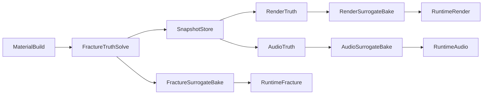

# Hyperreal Stone Pipeline Architecture

This architecture is designed for dual-objective execution from day one:
scientific-grade fidelity/determinism and state-of-the-art runtime performance.
All subsystems consume the same snapshot timeline and are governed to avoid tradeoffs between these objectives.

## Principles

- Fidelity/determinism and runtime performance are co-primary and non-negotiable.
- Shared state for mechanics, rendering, and audio to avoid cross-domain drift.
- Localized compute concentration near active fracture while preserving runtime budget discipline.
- Deterministic outputs and replayability are mandatory, not optional debug features.
- Every heavy module emits a runtime surrogate artifact with measurable quality bounds.

## Governance Coupling (v5)

This document is the technical architecture authority. Governance enforcement authority is defined separately.

- Automated promotion authority: `docs/governance/policy-verdict.md`
- Rule activation timing by phase: `docs/governance/phase-activation-matrix.md`
- Baseline promotion and retention lifecycle: `docs/governance/baseline-lifecycle.md`

Technical contracts defined here are consumed by governance checks; policy mechanics are not duplicated here.

## Subsystems

### 1) Material Authoring and PBSV Builder

Inputs:
- scanned/procedural stone source geometry,
- mineral composition priors,
- calibration samples.

Outputs:
- sparse voxel material channels,
- anisotropic property tensors,
- initial damage/microcrack fields.

Contract:
- must produce schema-compliant state described in `material-schema.md`.

### 2) Fracture Truth Solver

Core:
- MLS-MPM/APIC with displacement discontinuity handling.
- Narrow-band anisotropic SDF for crack-front localization.
- Local graph-of-grains refinement around active fronts.

Outputs:
- immutable snapshots at configured cadence,
- fracture/contact event streams,
- fragment and crack-surface derived data.

### 3) Render Truth Pipeline (Offline)

Goal:
- produce visual ground truth for intact and fractured states.

Stages:
1. Snapshot-to-geometry extraction:
   - generate crack surfaces and exposed internals,
   - reconstruct fragment surface detail at multi-scale.
2. Material translation:
   - map tensor and composition fields to spectral shading parameters,
   - derive roughness/normal/displacement fields from damage data.
3. Offline reference rendering:
   - path-traced spectral renders for fixed benchmark camera sets,
   - optional turntable sequences for temporal evaluation.

Outputs:
- high-sample reference frames,
- per-pass AOVs for diagnostics (`albedo`, `normal`, `depth`, `roughness`, `emission`),
- reference videos for side-by-side surrogate comparison.

### 4) Audio Truth Pipeline (Offline)

Goal:
- generate impact and fracture sound from physical state/events.

Stages:
1. Modal basis extraction:
   - derive local modal features from fragment geometry/material state.
2. Event-conditioned excitation:
   - impact/contact impulses excite modal banks,
   - fracture events trigger crack transients and debris layers.
3. Propagation and environment:
   - distance attenuation from listener path,
   - early reflection + late reverb via environment response model.
4. Mix and export:
   - emit dry stems and fully spatialized master.

Outputs:
- synchronized wave files for `impact`, `crack`, `debris`, `ambience`,
- metadata sidecar linking each audio segment to snapshot/event ids.

## Data Backbone

All stages read/write a shared snapshot/event timeline:

- `snapshot_id` is the cross-domain synchronization key.
- `event_id` references fracture/contact/debris events.
- strict append-only history supports deterministic replay.

The `snapshot_id` and `event_id` timeline is governance-critical and must remain machine-verifiable across subsystem outputs.

## Runtime Surrogate Artifacts (Compression Layer)

These artifacts are produced from truth outputs and loaded by runtime systems.

### Fracture Surrogates

- Reduced crack-state latent representation per region.
- Fracture mode basis for likely impact classes.
- Graph coarsening map from fine grain graph to runtime interaction graph.

### Render Surrogates

- Sparse virtual textures for exposed interior material.
- Multi-resolution displacement and normal atlases.
- Fragment LOD meshes with crack-preserving silhouettes.
- Optional neural shader/material surrogate for high-frequency response.

### Audio Surrogates

- Modal bank cache keyed by fragment class/material signature.
- Event-conditioned transient library (impact, crack, debris).
- Parametric propagation model for runtime distance/environment response.

### Surrogate Quality Contract

- Every surrogate includes a `truth_reference_id`.
- Max tolerated deviation is validated against `validation-metrics.md`.
- Promotion and retention of surrogate baselines follow `docs/governance/baseline-lifecycle.md`.

## Execution Graph

## Directory and Artifact Layout

- `data/hero-stone/` raw and processed stone inputs.
- `sim/config/` solver and scenario configs.
- `sim/snapshots/` canonical state timeline outputs.
- `sim/events/` fracture and contact event streams.
- `offline/render_truth/` rendered reference outputs.
- `offline/audio_truth/` generated reference audio outputs.
- `runtime/surrogates/fracture/` compressed fracture artifacts.
- `runtime/surrogates/render/` compressed visual artifacts.
- `runtime/surrogates/audio/` compressed audio artifacts.

## Interface Contracts

- Snapshot reader API:
  - `load_snapshot(snapshot_id) -> MaterialState`
  - `load_events(snapshot_id) -> EventBatch`
- Render truth API:
  - `render_reference(snapshot_id, camera_set_id) -> FrameBundle`
- Audio truth API:
  - `synthesize_reference(snapshot_range, listener_path_id) -> AudioBundle`
- Surrogate bake API:
  - `bake_surrogates(truth_reference_id, quality_tier) -> SurrogateBundle`

## Risks and Mitigations

- Risk: mismatch between simulation and render material interpretation.
  - Mitigation: maintain a single material translator with golden tests.
- Risk: audio drift from unsynchronized event timing.
  - Mitigation: lock audio event timestamps to snapshot clock and validate sync.
- Risk: surrogate quality collapse in edge fracture cases.
  - Mitigation: maintain outlier scenario set and hard fail on error threshold breach.
